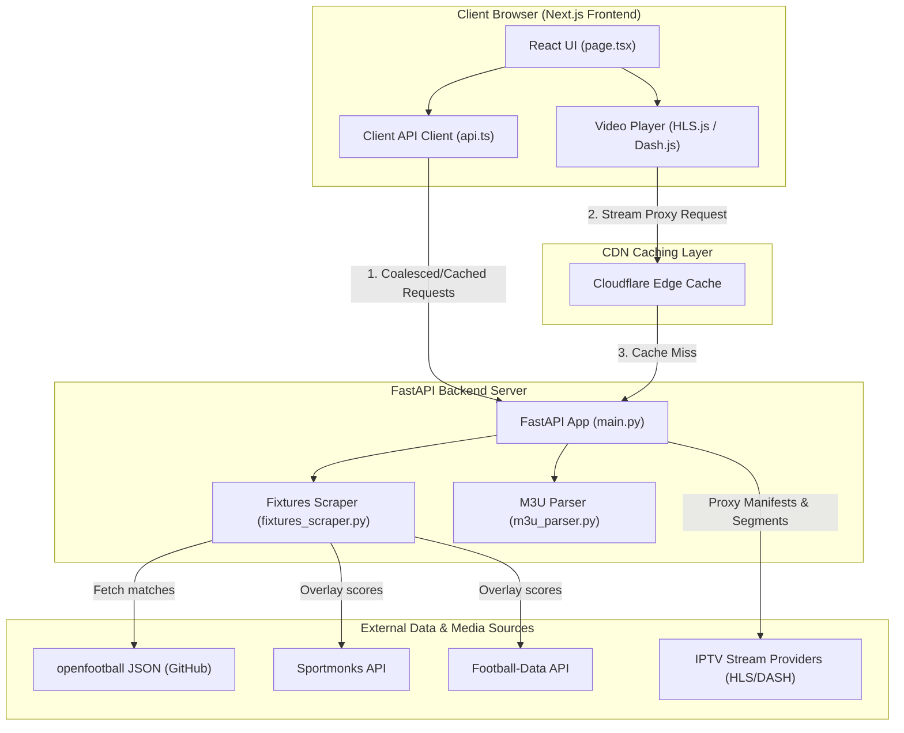

# D'one TV — FIFA World Cup 2026™ Live Streaming Hub

A premium, timezone-aware, high-performance web dashboard for live streaming the FIFA World Cup 2026™ (June 11 – July 19, 2026). It aggregates IPTV streams, dynamically translates schedules, overlays live scores, and provides low-latency video playback.

---

## 🚀 Key Features

### 📺 Advanced Live Streaming
* **IPTV Integration**: Parses M3U playlists, automatically backfilling missing stream metadata.
* **Low-Latency Video Playback**: Uses customized, low-buffer configurations for HLS.js and Dash.js to load streams quickly.
* **Custom CORS Proxy**: Proxies HLS (`.m3u8`) and DASH (`.mpd`) manifests and nested `.ts`/`.m4s` segments using a global connection pool, resolving browser cross-origin policy blocks.
* **Accurate Premium Logos**: Official, high-resolution logo mappings for premium sports channels (e.g., CCTV 5, ELTA Sports, Macao Sports/TDM, ColaTV).

### ⚽ Timezone-Aware Fixtures Dashboard
* **Dynamic World Cup Schedule**: Fetches official schedule and stadium metadata in real-time from the [openfootball/worldcup.json](https://github.com/openfootball/worldcup.json/tree/master/2026) repository, updating every 15 minutes.
* **Live Score Overlays**: Integrates Sportmonks & Football-Data APIs to overlay live match statistics on top of the fixture schedule.
* **Automatic Timezone Shifts**: Converts UTC match datetimes to the user's browser local date and time using their local timezone offset (`tz_offset`).
* **Digital Header Clock**: Monospace live digital clock in the header tracking local time (HH:MM:SS) with an interactive cyber-neon glow.

### 📱 Premium Responsive Layout
* **Desktop Dashboard**: 3-column split view aligning with the video player height:
  * **Left Sidebar**: Live Matches & Completed Results (filterable by date via inline calendar).
  * **Center**: Low-latency Video Player & Carousel Channel Grid.
  * **Right Sidebar**: Upcoming Matches (filterable by date).
* **Mobile View**: Bottom navigation tab layout styled like a native mobile app:
  * **Live Stream**: Player + Channels Grid.
  * **Live Score**: Current Live-only Matches.
  * **Results**: Date-filterable Completed Matches.
  * **Upcoming Match**: Date-filterable Upcoming Matches.

---

## 🛠 Tech Stack

* **Backend**: FastAPI, Python 3.10+, HTTPX (Async Client), Uvicorn.
* **Frontend**: Next.js 15+ (App Router, Turbopack), React 19, TypeScript, Vanilla CSS (Glassmorphism & Cyberpunk Neon).

---

## 📐 System Architecture

The following diagram outlines the system topology, showing the communication layout between the Client Browser, the CDN Edge Cache, the FastAPI server, and the external data feeds.



---

## 🔄 Request Coalescing & Caching Sequence

To handle massive concurrent traffic and prevent API rate-limits, caching and request coalescing (single-flight locking) are implemented at multiple levels of the request cycle:

```mermaid
sequenceDiagram
    autonumber
    participant UI as React UI (Page.tsx)
    participant ClientAPI as Client API (api.ts)
    participant Cloudflare as Cloudflare CDN
    participant FastAPI as FastAPI Backend (main.py)
    participant Scraper as Scraper Cache & Locks
    participant External as External APIs (Sportmonks)

    rect rgb(25, 30, 40)
        Note over UI, ClientAPI: Frontend Deduplication
        UI->>ClientAPI: fetchFixtures("2026-06-16") [Upcoming Effect]
        UI->>ClientAPI: fetchFixtures("2026-06-16") [Completed Effect]
        Note over ClientAPI: Coalesces duplicate requests<br/>for the same date
        ClientAPI->>FastAPI: HTTP GET /api/fixtures?date=2026-06-16 (1 request)
    end

    rect rgb(35, 45, 55)
        Note over FastAPI, External: Backend Caching & Single-Flight Locks
        FastAPI->>Scraper: Get fixtures for date
        alt Cache Hit (TTL < 15s)
            Scraper-->>FastAPI: Return cached JSON immediately
        else Cache Miss
            Scraper->>Scraper: Acquire lock for (date, tz_offset)
            Scraper->>External: Parallel Async HTTPX Requests
            External-->>Scraper: Return raw data
            Scraper->>Scraper: Parse & categorize fixtures
            Scraper->>Scraper: Save to final response cache
            Scraper-->>FastAPI: Return populated fixtures JSON
        end
        FastAPI-->>ClientAPI: HTTP 200 JSON Response
    end

    ClientAPI-->>UI: Return to Upcoming Effect
    ClientAPI-->>UI: Return to Completed Effect

    rect rgb(45, 55, 65)
        Note over UI, Cloudflare: Stream Segment Caching
        UI->>Cloudflare: GET /api/proxy-stream/c/.../segment_1.ts
        alt Cloudflare Cache Hit
            Cloudflare-->>UI: Serve segment instantly from Edge
        else Cache Miss
            Cloudflare->>FastAPI: Forward GET segment_1.ts
            FastAPI->>External: Stream from remote stream host
            External-->>FastAPI: Raw chunk data
            FastAPI-->>Cloudflare: Stream segment back (cache-control: public)
            Cloudflare-->>UI: Deliver segment and save to Cache
        end
    end
```



---

## ⚙️ Getting Started

### 1. Backend Setup (FastAPI)
Navigate to the backend directory, configure the environment, and start the uvicorn server.

```bash
# Navigate to backend
cd backend

# Create virtual environment
python3 -m venv venv
source venv/bin/activate

# Install dependencies
pip install -r requirements.txt

# Launch FastAPI development server
python main.py
```
*The backend server will run on [http://localhost:8000](http://localhost:8000).*

### 2. Frontend Setup (Next.js)
Open a new terminal window, navigate to the frontend directory, install npm packages, and spin up the development build.

```bash
# Navigate to frontend
cd frontend

# Install Node dependencies
npm install

# Start Next.js development server
npm run dev
```
*The web interface will run on [http://localhost:3000](http://localhost:3000).*

---

## 🗂 Project Structure

```
├── backend/
│   ├── main.py                # FastAPI main routes, stream proxies & refresh schedules
│   ├── fixtures_scraper.py    # Openfootball dynamic parser, timezone shift, API overlay
│   ├── m3u_parser.py          # IPTV playlist parser and custom channel logo mapping
│   ├── requirements.txt       # Python backend dependencies
│   └── channels_cache.json    # Local cached channels list (gitignored)
│
├── frontend/
│   ├── src/app/
│   │   ├── page.tsx           # Home dashboard & tab switcher
│   │   ├── layout.tsx         # Root layout with fonts
│   │   └── globals.css        # Layout grid, neon tokens & responsive styling
│   ├── src/components/
│   │   ├── Header.tsx         # Header navbar with local digital clock
│   │   ├── VideoPlayer.tsx    # Low-latency tuned HLS/DASH media player
│   │   ├── FixturesSidebar.tsx# Grouped completed/live/upcoming sidebars
│   │   └── ChannelGrid.tsx    # Channels selector carousel
│   └── src/lib/api.ts         # Frontend fetch client passing tz_offset
```
